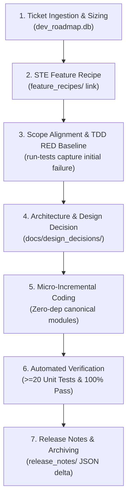

# AI Usage Monitor - Ways of Work (WoW) and Engineering Standards

**Document Version**: 1.0.0  
**Status**: Authoritative Protocol Specification  
**Derived From**: KloGnist Ways of Work v2.5.0  

---

## 1. Operational Philosophy & System Context

AI Usage Monitor is an agentic, security-first, zero-external-dependency desktop service and web dashboard that monitors AI token usage, sessions, quotas, and costs across providers (Claude, M365 Copilot, Gemini, Ollama, etc.).

### Core Engineering Rules
1. **Zero External Supply-Chain Risk (Zero Dependency Core)**:
   - Rely strictly on Python 3 Standard Library (`http.server.ThreadingHTTPServer`, `sqlite3`, `urllib.request`, `ctypes`, `dataclasses`, `unittest`).
   - Eliminate unnecessary npm or pip package dependencies.
2. **Native Windows Security**:
   - Secrets and credentials MUST use Windows DPAPI (`CryptProtectData` via `crypt32.dll`). Plaintext storage of API keys is strictly prohibited.
3. **Deterministic Quality over Agent Autonomy**:
   - Autonomous coding operates within structural guardrails: `dev_roadmap.db`, ASD-STE100 feature recipes, and TDD baseline assertions.
4. **Zero Assumptions & Empirical Log Verification**:
   - Every bug fix or feature must have test coverage. No change is marked successful without green test execution.
5. **Universal Reusability (DRY Canonical Components)**:
   - Backend logic resides in typed canonical provider/storage/security modules.
   - Frontend views reside in single canonical HTML components loaded dynamically.
6. **Privacy-First Proactive Diagnostics**:
   - Never log unredacted API keys, session tokens, or personal identifiers.
   - Provide one-click sanitized diagnostic bundles for rapid bug reporting.

---

## 2. 7-Step Development Cycle Lifecycle Protocol

### CLI Tooling Commands
- Initialize DB: `python dev_tools/manage_roadmap.py init`
- Check Status: `python dev_tools/manage_roadmap.py status`
- Run Tests: `python dev_tools/manage_roadmap.py run-tests`
- Generate Release Notes: `python dev_tools/manage_roadmap.py generate-release-notes --version v0.1.0`
