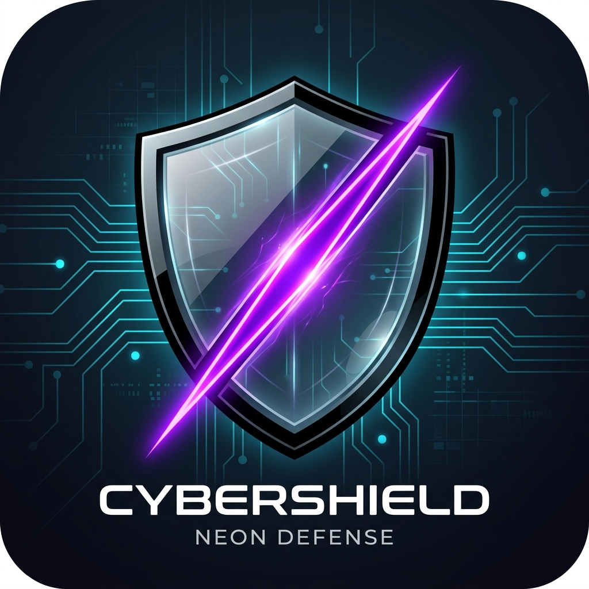

# AI Usage Monitor

<div align="center">
  
  <h3><em>"Number 5 is alive!"</em></h3>
  <p><strong>Lightweight, Security-First Desktop AI Telemetry Monitor & Floating Widget</strong></p>
</div>

[](https://github.com/Acidcow/AI_Usage_Monitor)
[](https://github.com/Acidcow/AI_Usage_Monitor)
[](https://github.com/Acidcow/AI_Usage_Monitor)
[-brightgreen.svg)](https://github.com/Acidcow/AI_Usage_Monitor)

A lightweight, security-first, zero-dependency desktop service and web dashboard that monitors AI token usage, sessions, rate limits, and costs across providers (**Claude**, **M365 Copilot**, **Google Gemini**, **Ollama**, and **ChatGPT**).

Includes an ambient **Windows System Tray** notification icon, a **Native Standalone Floating Desktop Widget**, automatic **Local Telemetry Scanners**, **1-Click Key Procurement Portals**, and an interactive **Johnny 5 Mascot System** with switchable cybernetic icons!

---

## 🤖 Visual Identity & Johnny 5 Mascot System

AI Usage Monitor features a bespoke, retro-futuristic visual identity inspired by **Johnny 5** (*Short Circuit*) along with a cryptographic Cyber Shield icon option:

| Johnny 5 Alive (Primary Icon) | Cyber Shield (Option B) | Johnny 5 Pointing (Mascot) | Johnny 5 Inspecting (Sessions) | Johnny 5 Success (Health) |
| :---: | :---: | :---: | :---: | :---: |
|  |  |  |  |  |
| *Glowing cyan optics & circuits* | *Glass shield with neon purple slash* | *Main dashboard assistant ("Input!")* | *Scanning telemetry holograms* | *Zero malfunctions detected!* |

- **Dynamic Icon Switcher**: Toggle effortlessly between the glowing **Johnny 5** headshot and the **Cyber Shield** directly in the header or via the `🎨 Icons` customizer modal.
- **Contextual UI Mascot**:
  - **Main Dashboard**: Johnny 5 points to insights with rotating interactive quotes (*"No disassemble! Protecting keys with DPAPI"*).
  - **Recent Sessions**: Johnny 5 inspects token streams with holographic sensors.
  - **Diagnostic Troubleshooter**: Johnny 5 delivers a cheerful thumbs-up when zero malfunctions or rate limits are detected.
  - **Floating Mini-Widget**: Miniature glowing Johnny 5 badge in the draggable taskbar header.

---

## Key Highlights

- **Zero External Dependencies**: Built entirely with Python 3 Standard Library (`http.server.ThreadingHTTPServer`, `sqlite3`, `ctypes`, `urllib.request`). Eliminates `npm` and `pip` supply-chain vulnerabilities.
- **Native Windows DPAPI Encryption**: Secrets and API keys are encrypted at rest using Windows Data Protection API (`crypt32.dll` via `ctypes`) tied directly to your Windows logon. Plaintext secrets are never written to disk.
- **Standalone Desktop Floating Widget**:
  - Chromeless, standalone mini-widget window powered by pre-installed Microsoft Edge app mode (`msedge.exe --app`).
  - Snaps automatically to the bottom-right corner directly above the Windows taskbar and system tray using Win32 Work Area geometry (`ctypes.windll.user32`).
  - Draggable anywhere on screen via fluid `-webkit-app-region: drag` header.
  - Interactive multi-provider cycler (toggle between Claude, Gemini, ChatGPT, Ollama, and Copilot metrics with one click).
  - Launchable via CLI (`python run_monitor.py --widget`), Windows System Tray menu, or Web Dashboard header button (`🪟 Floating Widget`).
- **Automated Key Procurement & Direct Portals**:
  - Direct 1-click external navigation buttons automagically guide users to vendor key generation portals (**Google AI Studio**, **Anthropic Console**, **OpenAI Platform**, **M365 Admin Usage Reports**, and **Ollama Hub**).
  - In-modal step-by-step guides with 1-click clipboard paste (`📋 Paste`) and pricing/documentation quick-links.
- **Claude Multi-Mode Ingestion**:
  1. **Direct Anthropic API Poller**: Queries rate limits and token balances via official endpoints.
  2. **Transparent Intercepting Proxy (`http://127.0.0.1:8766/v1`)**: Route CLI tools (e.g. `claude-code`, Continue, Aider) through this local endpoint to automatically capture token metrics with zero latency.
  3. **Local CLI Cache Scanner**: Ingests session cache and telemetry from local tool logs.
  4. **Offline / Demo Simulator**: Pre-seed realistic token flows and rate-limit drops for testing and demonstration without real billing.
- **Multi-Provider Architecture**:
  - **Claude (Anthropic)**: Rate limits, resets, CLI scanner, transparent proxy, and tokens.
  - **Google Gemini**: Google AI Studio API key adapter with Windows DPAPI encryption and live model quota interrogation.
  - **ChatGPT / OpenAI**: OpenAI Developer Platform API key adapter with DPAPI vault persistence and model interrogation.
  - **Microsoft 365 Copilot**: Enterprise-restricted passive adapter (proxy & corporate telemetry parser).
  - **Ollama**: Local instance poller (`http://localhost:11434`) with model detection, parameter sizes, and quantization.
- **Desktop UI**:
  - **Glassmorphic Web Dashboard**: Animated radial gauges, session breakdown, provider cards, and hourly trends.
  - **Compact Status Bar Widget (`/mini_widget.html`)**: Floating/dockable micro-bar widget with live tokens, quota meter, and reset countdown.
  - **Windows System Tray**: Native taskbar tray icon with dynamic tooltips and right-click context menu.
- **Proactive Redacted Diagnostics**:
  - Automatically redacts API keys (`sk-ant-***`, `AIzaSy***`, `sk-proj-***`), tokens, passwords, and Windows usernames (`<REDACTED_USER>`).
  - One-click "Copy Diagnostic Bundle" and "Download JSON" for bug reporting without leaking secrets.

---

## Quick Start (Windows)

### Option 1: One-Click PowerShell Bootstrap
```powershell
powershell -ExecutionPolicy Bypass -File .\setup.ps1
```

### Option 2: Direct Python Command
```powershell
# Launch with Web Dashboard and Demo Simulation pre-seeded
python run_monitor.py --open-browser --demo
```

Access points:
- **Web Dashboard**: [http://127.0.0.1:8765](http://127.0.0.1:8765)
- **Mini Status Bar Widget**: [http://127.0.0.1:8765/mini_widget.html](http://127.0.0.1:8765/mini_widget.html)
- **Transparent Claude Proxy**: `http://127.0.0.1:8766/v1`

---

## Transparent Proxy Usage (for Claude CLI / Tools)

To track tokens automatically from any local CLI tool or IDE extension, point the tool's base URL to the local proxy:

```powershell
# Example: Setting Anthropic base URL for Claude CLI tools or custom scripts
$env:ANTHROPIC_BASE_URL = "http://127.0.0.1:8766"
```

The proxy intercepts request and response token metrics (`usage.input_tokens`, `usage.output_tokens`, `anthropic-ratelimit-*`), records them in the local SQLite database, and streams the response without delay.

---

## KloGnist Ways of Work (WoW) Protocol

This project adheres to the **KloGnist Rule-Governed Engineering Protocol**:

```powershell
# Check current roadmap status & tickets
python dev_tools/manage_roadmap.py status

# Run the automated multi-tier unit & security test suite
python dev_tools/manage_roadmap.py run-tests

# Generate cumulative release notes
python dev_tools/manage_roadmap.py generate-release-notes --version v0.1.0
```

### Repository Structure
```
AI_Usage_Monitor/
├── .agents/                    # KloGnist Rules & Protocol (AGENTS.md)
├── dev_tools/                  # Unified Roadmap CLI & Test Runner
│   ├── manage_roadmap.py
│   └── selective_test_runner.py
├── dev_roadmap.db              # SQLite developer tracking database
├── docs/design_decisions/      # Architecture Decision Records (ADRs)
├── feature_recipes/            # ASD-STE100 Feature Specifications
├── backend/                    # Zero-dependency Python core
│   ├── security/dpapi_vault.py # Windows DPAPI encryption
│   ├── storage/database.py     # SQLite time-series storage
│   ├── diagnostics/            # Proactive sanitized logging & bundle export
│   ├── providers/              # Multi-mode providers (Claude, Gemini, etc.)
│   ├── proxy/                  # Transparent CLI intercepting proxy
│   ├── server/                 # ThreadingHTTPServer & REST API
│   └── tray/                   # Native Windows System Tray (shell32.dll)
├── frontend/                   # Vanilla HTML5/CSS3/JS Web UI
│   ├── index.html              # Main dashboard SPA shell
│   ├── mini_widget.html        # Compact status bar widget view
│   ├── css/styles.css          # Dark-mode glassmorphic design system
│   ├── js/app.js               # Dashboard controller & live poller
│   ├── js/widget.js            # Mini widget controller
│   └── components/             # Canonical web components (DRY standard)
├── release_notes/              # Version release notes (RELEASE_v0.1.0.md)
├── tests/                      # 25 automated unit & security tests (100% pass)
├── run_monitor.py              # Main service entrypoint
└── setup.ps1                   # Bootstrap script
```

---

## Testing & Quality Assurance

Run the test suite at any time:
```powershell
python -m unittest discover tests -v
```

All 25 tests pass out of the box with zero third-party dependencies required.